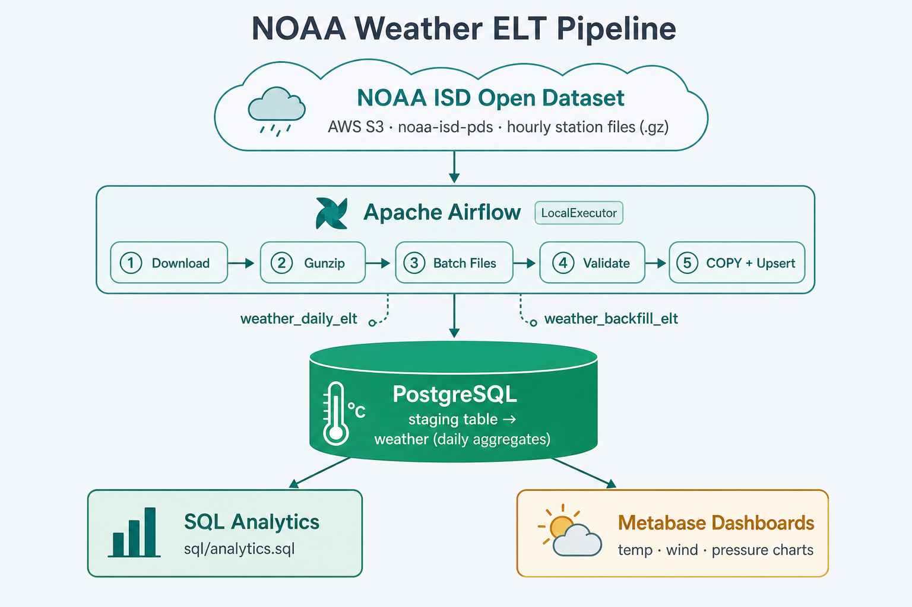

# Weather ETL Pipeline

ELT pipeline for [NOAA Integrated Surface Database (ISD)](https://www.ncei.noaa.gov/products/land-based-station/integrated-surface-database) lite data hosted on AWS open data (`noaa-isd-pds`).

Pulls hourly station files, batches them, loads into PostgreSQL, and rolls up daily metrics (temp, dew point, pressure, wind, precipitation). Airflow orchestrates the daily and backfill flows; Metabase or plain SQL works for charts on top.

## Architecture



| Component | Role |
|---|---|
| Airflow (LocalExecutor) | orchestration |
| PostgreSQL | staging + `weather` table |
| boto3 | download from public NOAA S3 |
| Metabase (optional) | dashboards |

Details: [`docs/ARCHITECTURE.md`](docs/ARCHITECTURE.md)

## Pipeline

```text
download_noaa → extract_batch → validate_batches → load_and_upsert
```

Daily DAG filters S3 objects touched in the last 24 hours. Backfill DAG walks full years.

## Setup

```bash
cp config/settings.example.ini config/settings.ini

docker compose build airflow-webserver
docker compose up -d
```

Airflow UI: http://localhost:8081 — `admin` / `admin`

Postgres is on port **5433** on localhost (so it won't clash with other local DBs).

Enable `weather_daily_elt` or trigger a backfill run from the UI.

## Local run

```bash
python -m venv .venv && source .venv/bin/activate
pip install -r requirements.txt
export SETTINGS_PATH="$(pwd)/config/settings.ini"
python scripts/run_local.py --year 2024
```

## Schema

Daily row per `(station_id, date)` with avg/min/max for temperature, dew point, pressure, wind, and precipitation fields. See `setup/init.sql`.

Example queries: [`sql/analytics.sql`](sql/analytics.sql)

## License

MIT
